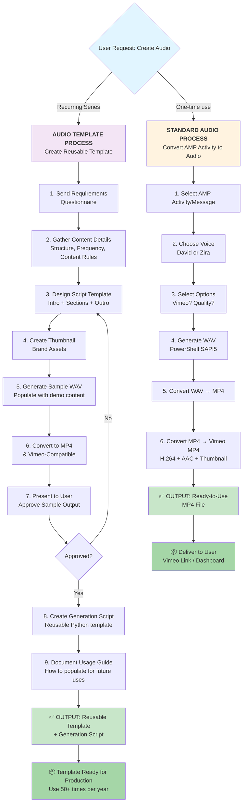
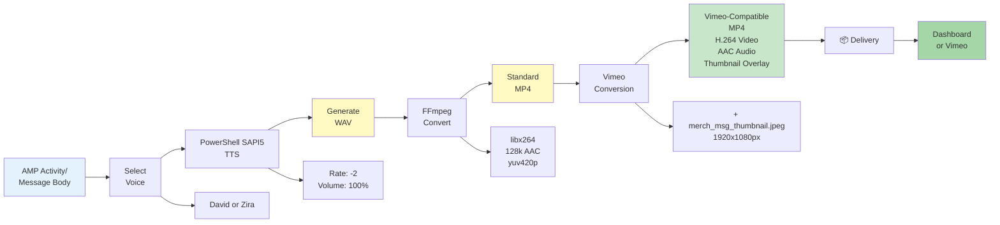
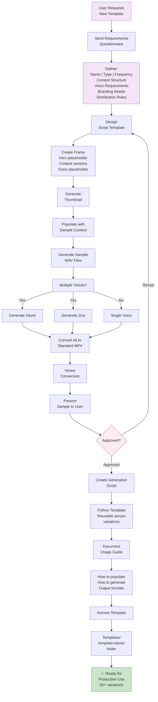
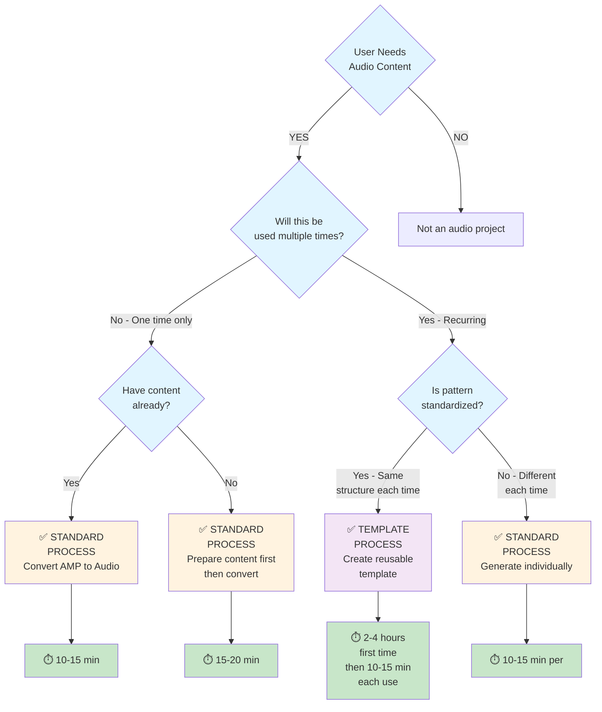
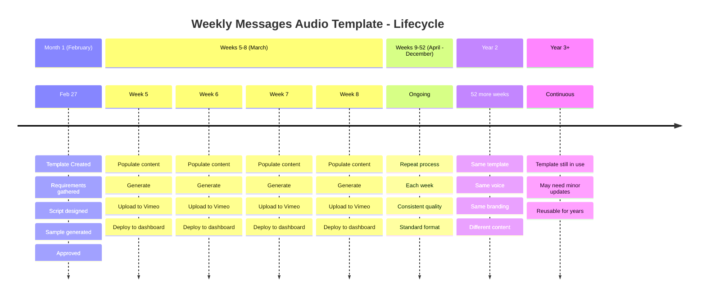

# Audio Process Flow Diagrams - Zorro

## Diagram 1: Complete Two-Process Comparison



---

## Diagram 2: Standard Audio Process - Detailed



---

## Diagram 3: Audio Template Creation Process - Detailed



---

## Diagram 4: Decision Tree - Which Process to Use?



---

## Diagram 5: File Organization in Zorro

```
Store Support/Projects/AMP/Zorro/
│
├── 📁 Audio/ ━━━━━ [ALL AUDIO PRODUCTION WORK]
│   │
│   ├── 📁 Templates/ ━━━━━ [REUSABLE TEMPLATES]
│   │   ├── 📁 weekly-messages-summarized/
│   │   │   ├── generate_weekly_messages.py
│   │   │   ├── script_template.md
│   │   │   ├── requirements.txt
│   │   │   └── thumbnail.jpeg
│   │   │
│   │   ├── 📁 [other-templates]/
│   │   └── TEMPLATE_LIBRARY.md
│   │
│   ├── 📁 Scripts/ ━━━━━ [CORE UTILITIES]
│   │   ├── generate_both_voices.py
│   │   ├── generate_summarized_final_zira.py
│   │   ├── convert_wav_to_mp4_installer.py
│   │   ├── convert_standard_to_vimeo.py
│   │   ├── create_audio_thumbnail.py
│   │   └── podcast_server.py
│   │
│   ├── 📁 Output/ ━━━━━ [GENERATED FILES]
│   │   ├── 📁 podcasts/
│   │   │   ├── *.mp4 [Final audio files]
│   │   │   └── .jpeg [Thumbnails]
│   │   │
│   │   └── 📁 archive/
│   │       └── [Older versions]
│   │
│   └── 📁 Documentation/ ━━━━━ [KNOWLEDGE BASE]
│       ├── AUDIO_PROCESS_GUIDE.md ⬅️ THIS FILE
│       ├── REQUIREMENTS_QUESTIONNAIRE.md
│       ├── TEMPLATE_LIBRARY.md
│       └── GENERATION_SCRIPTS.md
│
└── [Other Zorro folders...]
```

---

## Diagram 6: Template Lifecycle - Weekly Messages Example



