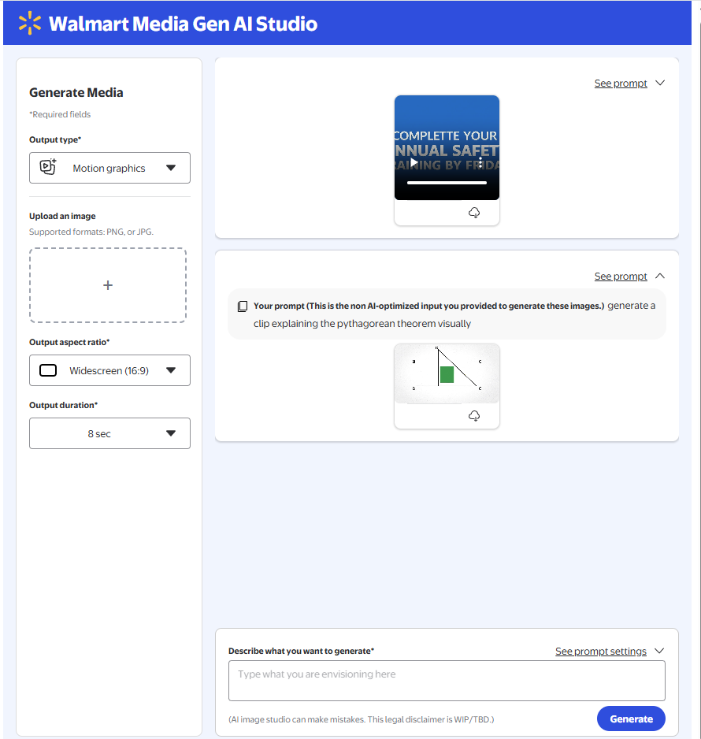
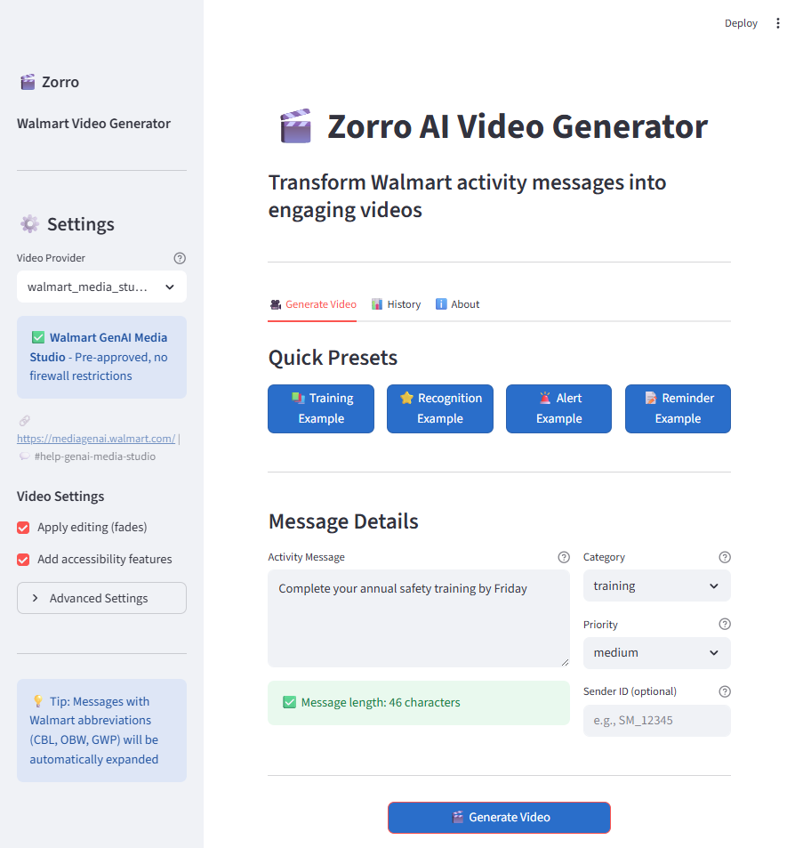

# Walmart GenAI Media Studio Integration Guide



## Overview

This document outlines how to integrate the Zorro video generation system with Walmart's **GenAI Media Studio** - an internal, pre-approved platform for AI-powered video generation.

## Why GenAI Media Studio?

✅ **Pre-Approved**: No firewall restrictions, no external downloads needed  
✅ **SSO Authentication**: Uses your Walmart credentials  
✅ **Production-Ready**: Monitored, logged, and compliant  
✅ **Latest Models**: Google Veo and Imagen via LLM Gateway  
✅ **API Access**: Programmatic integration available  

## Integration Architecture

```
User Input (Activity Message)
    ↓
Zorro GUI (app.py)
    ↓
Message Processor → Prompt Generator
    ↓
GenAI Media Studio Provider (NEW)
    ↓
Walmart LLM Gateway → Google Veo
    ↓
Generated Video → Display in GUI
```

## Implementation Steps

### Phase 1: Manual Testing (Immediate - 30 minutes)



1. **Access GenAI Media Studio**:
   - Navigate to: https://mediagenai.walmart.com/
   - Login with your Walmart SSO credentials
   - Test text-to-video generation with sample prompts

2. **Test with Zorro Prompts**:
   - Run the GUI: `python run_gui.py`
   - Generate a prompt (without video generation)
   - Copy the enhanced prompt to GenAI Media Studio
   - Validate video output quality

3. **Evaluate Results**:
   - Check if video style matches requirements
   - Test different prompt variations
   - Note any limitations or constraints

### Phase 2: API Integration (1-2 days)

1. **Request API Access**:
   - Contact: Next Gen Content DS team
   - Slack: #help-genai-media-studio
   - Request: "API access for activity message to video generation"

2. **Create Media Studio Provider**:
   ```python
   # src/providers/walmart_media_studio.py
   class WalmartMediaStudioProvider(BaseVideoProvider):
       """Video generation using Walmart GenAI Media Studio."""
       
       def __init__(self):
           self.api_endpoint = "https://mediagenai.walmart.com/api/v1"  # TBD
           self.auth_token = self._get_sso_token()
       
       def generate(self, prompt: VideoPrompt) -> GeneratedVideo:
           # Call Media Studio API
           # Return video URL/path
   ```

3. **Update Configuration**:
   ```yaml
   # config/config.yaml
   video_generation:
     provider: "walmart_media_studio"
     walmart_media_studio:
       api_endpoint: "https://mediagenai.walmart.com/api/v1"
       auth_method: "sso"
       timeout: 300
   ```

### Phase 3: GUI Enhancement (1 day)

1. **Add SSO Authentication Flow**:
   - Integrate Walmart SSO in Streamlit
   - Store auth token in session state
   - Handle token refresh

2. **Add Provider Selection**:
   - Allow users to choose provider (if multiple available)
   - Display provider status (authenticated, available)

3. **Enhanced Monitoring**:
   - Display generation status from Media Studio
   - Show estimated completion time
   - Track usage/costs via Element GenAI Platform

### Phase 4: Production Deployment (2-3 days)

1. **Containerize Application**:
   ```dockerfile
   # Dockerfile
   FROM walmart-python:3.9
   COPY . /app
   WORKDIR /app
   RUN pip install -r requirements.txt
   CMD ["streamlit", "run", "app.py"]
   ```

2. **Deploy to Walmart Azure**:
   - Use Walmart-managed Azure subscription
   - Deploy via element MLOps or Azure App Service
   - Configure SSO and networking

3. **Submit System Security Plan (SSP)**:
   - Document data flows
   - List all AI services used
   - Security review and approval

## API Integration Example

### Request Format (Estimated)

```python
import requests

def generate_video_media_studio(prompt: str, auth_token: str) -> str:
    """Generate video using GenAI Media Studio API."""
    
    response = requests.post(
        "https://mediagenai.walmart.com/api/v1/video/generate",
        headers={
            "Authorization": f"Bearer {auth_token}",
            "Content-Type": "application/json"
        },
        json={
            "prompt": prompt,
            "model": "veo",  # Google Veo
            "duration": 5,   # 5-second video
            "style": "professional",
            "aspect_ratio": "16:9"
        }
    )
    
    result = response.json()
    return result["video_url"]
```

### Response Format (Estimated)

```json
{
  "video_id": "uuid-1234",
  "video_url": "https://mediagenai.walmart.com/videos/uuid-1234.mp4",
  "status": "completed",
  "duration": 5.2,
  "created_at": "2025-11-12T10:30:00Z",
  "metadata": {
    "model": "veo",
    "prompt": "...",
    "cost": "$0.05"
  }
}
```

## Compliance & Security

### Required Before Production

- [ ] Submit System Security Plan (SSP)
- [ ] Legal review of AI-generated content usage
- [ ] Data privacy assessment (if using customer data)
- [ ] Brand guidelines compliance check
- [ ] Cost allocation/chargeback setup

### Best Practices

1. **Authentication**: Always use Walmart SSO, never hardcode credentials
2. **Logging**: Integrate with Element GenAI Platform for audit trails
3. **Error Handling**: Graceful fallbacks if Media Studio is unavailable
4. **Rate Limiting**: Respect API quotas and implement backoff
5. **Content Moderation**: Validate prompts before sending to API

## Alternative Approaches

### If API Access is Delayed

1. **Manual Workflow**:
   - GUI generates prompts
   - User copies to Media Studio web UI
   - Downloads video and uploads back to GUI

2. **Hybrid Approach**:
   - Use Media Studio for video generation
   - Keep Zorro for prompt enhancement
   - Add import/upload feature to GUI

### If Need Additional Models

1. **Request Internal Hosting**:
   - Contact element MLOps team
   - Request ModelScope model hosting internally
   - Slack: #help-genai-media-studio

2. **Use Azure OpenAI for Fallback**:
   - Text/image generation via Walmart LLM Gateway
   - Combine frames into video using internal tools

## Timeline

| Phase | Duration | Blocker |
|-------|----------|---------|
| Manual Testing | 30 min | None - can start immediately |
| API Access Request | 1-3 days | Approval from Next Gen Content DS |
| Provider Implementation | 1-2 days | API documentation |
| GUI Integration | 1 day | Testing environment |
| Production Deployment | 2-3 days | SSP approval |
| **Total** | **1-2 weeks** | |

## Immediate Next Steps

1. **Test Media Studio Now** (30 minutes):
   ```bash
   # Run GUI to generate prompts
   python run_gui.py
   
   # Open Media Studio in browser
   start https://mediagenai.walmart.com/
   
   # Test manual workflow
   ```

2. **Request API Access** (5 minutes):
   - Post in #help-genai-media-studio:
     ```
     Hi team! I'm building an activity message to video generation system and 
     would like API access to GenAI Media Studio. Currently using the web UI 
     for testing, but need programmatic integration for production.
     
     Use case: Convert structured activity messages (user achievements, 
     milestones) into short celebration videos.
     
     Can someone from Next Gen Content DS team reach out? Thanks!
     ```

3. **Document Current Flow** (15 minutes):
   - Record which prompts work well in Media Studio
   - Note any style/format preferences
   - Document any limitations found

## Support Resources

- **Slack Channels**:
  - `#help-genai-media-studio` - Primary support
  - `#converse-with-us` - General GenAI questions
  - Element GenAI Platform - Platform support

- **Documentation**:
  - GenAI Media Studio: https://mediagenai.walmart.com/
  - Element GenAI: Internal documentation
  - element MLOps: Internal documentation

- **Contacts**:
  - Next Gen Content DS team - API access
  - Gen AI Enablement team - Platform onboarding
  - InfoSec - Security reviews

## Success Metrics

After integration, you should see:

✅ Video generation working without external downloads  
✅ Sub-5-minute generation time per video  
✅ SSO-authenticated, compliant workflow  
✅ Full audit trail in Element GenAI Platform  
✅ Cost tracking and chargeback integration  
✅ Production-ready deployment on Azure  

---

**Status**: Ready to start manual testing immediately!  
**Next Action**: Open https://mediagenai.walmart.com/ and test with sample prompts
